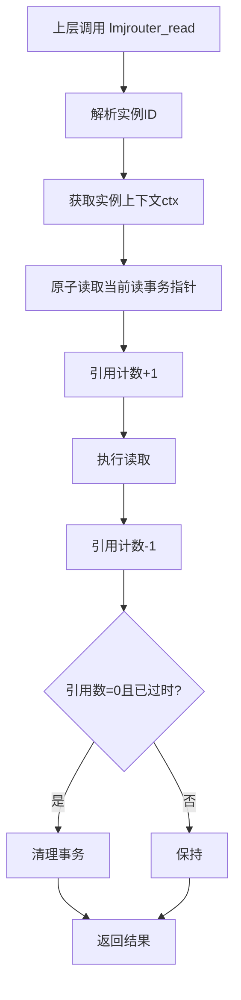
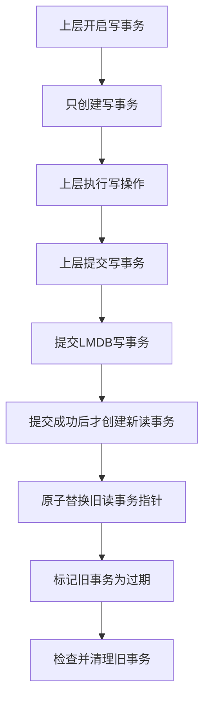

## 一、读取流程

```mermaid
flowchart TD
    A[上层调用 lmjrouter_read] --> B[解析实例ID]
    B --> C[获取实例上下文ctx]
    
    C --> D[原子读取当前读事务指针<br>]
    
    D --> E[引用计数+1]
    
    E --> F[执行读取]
    
    F --> G[引用计数-1]
    
    G --> H{引用数=0且已过时?}
    H -->|是| I[清理事务]
    H -->|否| J[保持]
    
    I --> K[返回结果]
    J --> K
```

## 二、写入流程

``` mermaid
flowchart TD
    A[上层开启写事务] --> B[只创建写事务]
    B --> C[上层执行写操作]
    C --> D[上层提交写事务]
    D --> E[提交LMDB写事务]
    E --> F[提交成功后才创建新读事务]
    F --> G[原子替换旧读事务指针]
    G --> H[标记旧事务为过期]
    H --> I[检查并清理旧事务]
```